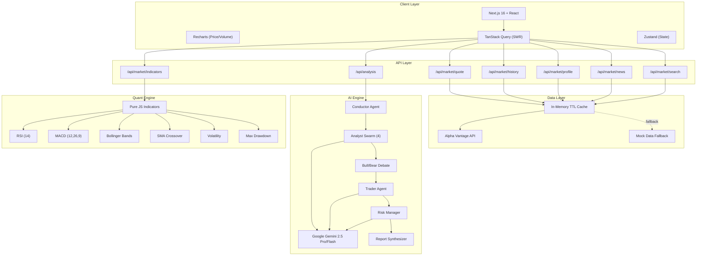
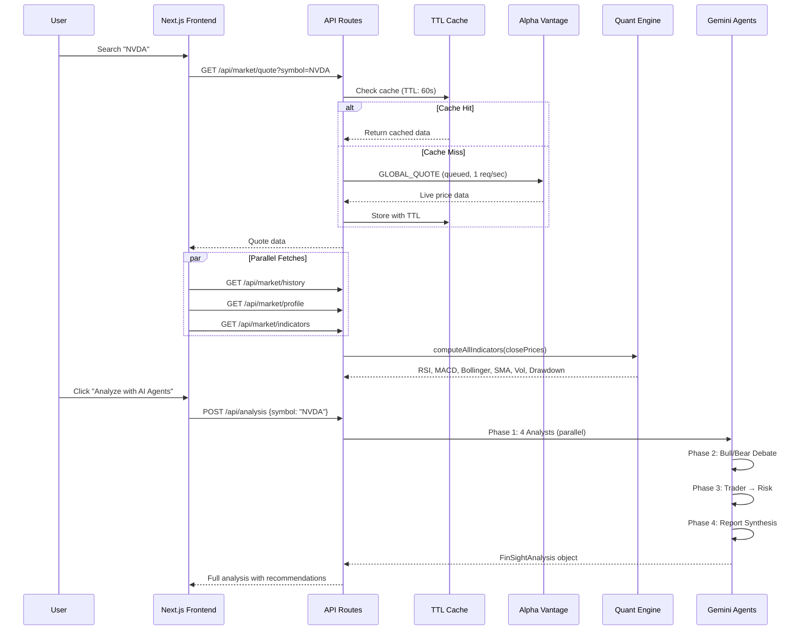
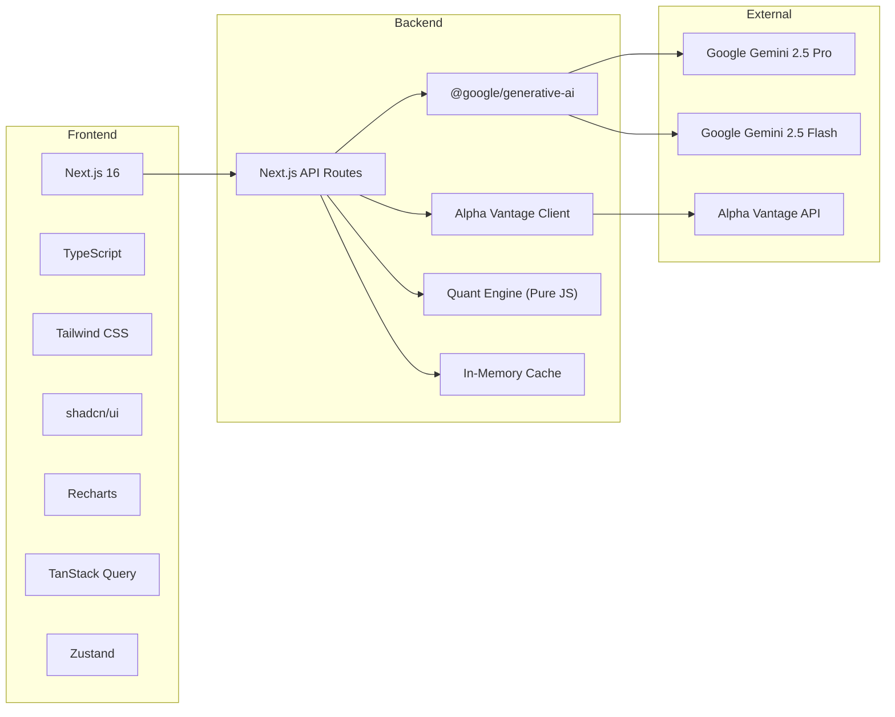

# FinSight: An AI-Powered Multi-Agent Financial Intelligence Platform

**Author:** Akhil Ageer  
**Course:** CSCI 5801 — Advanced Artificial Intelligence  
**Institution:** Kean University  
**Date:** April 2026

---

## Abstract

FinSight is a Bloomberg Terminal-inspired financial intelligence platform that employs a multi-agent Large Language Model (LLM) architecture to democratize institutional-grade stock analysis. The system integrates Google's Gemini 2.5 Pro/Flash models in an 8-agent pipeline — featuring Fundamental, Technical, Sentiment, and News analysts that feed into a Bull/Bear investment debate, followed by Trader decision-making, Risk management, and Report synthesis. A key differentiator is the "Quants for Everyone" module, which computes quantitative indicators (RSI, MACD, Bollinger Bands, SMA crossovers, Volatility, Max Drawdown) in pure JavaScript and uses AI to explain them in plain English with real-world analogies, making Wall Street-grade analysis accessible to retail investors with no financial background.

---

## 1. Introduction & Motivation

The financial analysis landscape has historically been bifurcated: institutional investors have access to Bloomberg Terminals ($24,000/year), multi-desk research teams, and sophisticated quantitative models, while retail investors rely on basic screeners and financial news. Recent advances in Large Language Models (LLMs) — particularly Google's Gemini 2.5 family — create an opportunity to bridge this gap through **agentic AI systems** that can reason, debate, and synthesize like a team of human analysts.

FinSight was researched and developed to address three core problems:

1. **Access Inequality:** Retail investors lack the tools that institutional desks take for granted.
2. **Information Overload:** Financial data is fragmented across fundamentals, technicals, news, and sentiment — no single tool synthesizes them.
3. **Quant Literacy Gap:** Quantitative indicators (RSI, MACD, Bollinger Bands) are powerful but incomprehensible to most people.

### 1.1 Research Approach

I researched existing multi-agent financial systems, Bloomberg-style data platforms, and educational fintech approaches. Key inspiration came from:

- **TradingAgents** (Tauric Research) — for multi-agent debate architecture
- **ai-hedge-fund** (virattt) — for investor persona agents
- **OpenBB** (OpenBB-finance) — for data platform structure and API design
- **Algorithmic Trading ML** (Luchkata) — for quantitative indicator computation patterns
- **TradingView MCP** (tradesdontlie) — for financial data visualization approaches

---

## 2. System Architecture

### 2.1 High-Level Architecture



### 2.2 Multi-Agent Pipeline (Agentic Workflow)

```mermaid
graph LR
    subgraph "Phase 1: Analysis<br/>(Parallel)"
        FA["🏛️ Fundamental<br/>Analyst<br/>(Flash)"]
        TA["📊 Technical<br/>Analyst<br/>(Flash + Quants)"]
        SA["💬 Sentiment<br/>Analyst<br/>(Flash)"]
        NA["📰 News<br/>Analyst<br/>(Flash)"]
    end

    subgraph "Phase 2: Debate"
        Bull["🐂 Bull Researcher<br/>(Cathie Wood)"]
        Bear["🐻 Bear Researcher<br/>(Michael Burry)"]
        Judge["⚖️ Debate Judge<br/>(Pro)"]
    end

    subgraph "Phase 3: Decision"
        TR["💼 Trader<br/>(Pro)"]
        RM["🛡️ Risk Manager<br/>(Flash)"]
    end

    subgraph "Phase 4: Output"
        RP["📋 Report<br/>Synthesizer<br/>(Flash)"]
    end

    FA & TA & SA & NA --> Bull & Bear
    Bull & Bear --> Judge
    Judge --> TR --> RM --> RP

    style FA fill:#065f46,stroke:#10b981
    style TA fill:#065f46,stroke:#10b981
    style SA fill:#065f46,stroke:#10b981
    style NA fill:#065f46,stroke:#10b981
    style Bull fill:#166534,stroke:#22c55e
    style Bear fill:#7f1d1d,stroke:#ef4444
    style Judge fill:#1e3a5f,stroke:#3b82f6
    style TR fill:#78350f,stroke:#f59e0b
    style RM fill:#4a1d96,stroke:#a855f7
    style RP fill:#9a3412,stroke:#ff6600
```



### 2.3 Data Flow Architecture



### 2.4 Caching Strategy

| Data Type | TTL | Rationale |
|-----------|-----|-----------|
| Stock Quote | 60 seconds | Balance between freshness and rate limits |
| Price History | 5 minutes | Daily data doesn't change intraday |
| Company Profile | 24 hours | Fundamental data changes quarterly |
| News | 5 minutes | Fresh news is important but rarely updates per-second |
| Search Results | 5 minutes | Symbol lists are static |
| AI Analysis | 4 hours | Expensive to generate, insights are time-stable |

---

## 3. Quants for Everyone — Educational Module

### 3.1 Philosophy

Traditional quantitative indicators are powerful predictive tools used by hedge funds and algorithmic trading firms. However, they're presented in jargon that excludes retail investors. FinSight's "Quants for Everyone" module computes these indicators in **pure JavaScript** (no Python, no external libraries, no ML models required) and uses Gemini AI to generate **plain-English explanations with real-world analogies**.

### 3.2 Implemented Indicators

| Indicator | Formula | What It Measures | FinSight Analogy |
|-----------|---------|-----------------|------------------|
| **RSI (14)** | 100 - (100 / (1 + avgGain/avgLoss)) | Momentum / Overbought-Oversold | "Like a sprinter — RSI shows if the stock is exhausted or has energy left" |
| **MACD (12,26,9)** | EMA(12) - EMA(26), Signal: EMA(9) of MACD | Trend strength & direction | "Like two runners — when the faster one overtakes the slower one, momentum is building" |
| **Bollinger Bands** | SMA(20) ± 2×StdDev(20) | Volatility envelope | "Like a boat and harbor buoys — sailing past the buoy means you're in unusual territory" |
| **SMA Crossover (50/200)** | SMA(50) vs SMA(200) | Long-term trend (Golden/Death Cross) | "Like monthly grades vs yearly average — recent performance above long-term = bullish" |
| **Volatility (Annualized)** | StdDev(returns) × √252 | Risk/uncertainty | "Like a roller coaster — higher volatility = bigger ups and downs" |
| **Max Drawdown** | Max peak-to-trough decline | Worst-case loss | "If you invested $10K at the worst time, how much would you have temporarily lost" |
| **52-Week Position** | (Price - Low52) / (High52 - Low52) × 100 | Where in the yearly range | "Like a mountain climber — 90% means you're near the summit" |

### 3.3 Signal Aggregation

Each indicator produces a signal (`bullish`, `bearish`, `neutral`) with strength (`strong`, `moderate`, `weak`). The Overall Quant Score is computed as a weighted composite:

```
Overall Score = Σ(indicator_score × weight) / Σ(weights)
Range: -100 (extremely bearish) to +100 (extremely bullish)
```

---

## 4. Technology Stack



| Layer | Technology | Justification |
|-------|-----------|---------------|
| Framework | Next.js 16 (App Router) | Server-side API routes + client-side SPA |
| Language | TypeScript | Type safety critical for financial data |
| UI Components | shadcn/ui + Tailwind CSS | Accessible, Bloomberg-dark aesthetic |
| Charts | Recharts | Composable, React-native, responsive |
| State | Zustand + TanStack Query | Client state + server state with SWR |
| LLM | Google Gemini 2.5 Pro/Flash | Free with Ultra membership, JSON mode, massive context |
| Market Data | Alpha Vantage (free tier) | 25 calls/day, real OHLCV + fundamentals + news |
| Quant Engine | Pure JavaScript | Zero dependencies, runs on server and client |

---

## 5. Literature Review & Comparative Analysis

### 5.1 Reference Works

| # | Reference | What We Learned | How FinSight Differs | Our Novelty |
|---|-----------|----------------|---------------------|-------------|
| 1 | **TradingAgents** (Tauric Research, 2024) — [GitHub](https://github.com/TauricResearch/TradingAgents) | Multi-agent debate architecture with LangGraph; Bull/Bear researcher roles; specialized analyst agents for fundamentals, technicals, sentiment, news | FinSight implements a similar pipeline but uses **Gemini 2.5** instead of OpenAI/Anthropic, runs entirely in-browser via Next.js API routes (no Python backend), and adds a **Risk Manager** gate before final recommendations | Web-native implementation; no Python dependency; integrated quant engine; educational explanations |
| 2 | **ai-hedge-fund** (virattt, 2024) — [GitHub](https://github.com/virattt/ai-hedge-fund) | Investor persona agents (Buffett, Munger, Ackman); structured JSON output from LLMs; portfolio construction via agent consensus | FinSight adopts the persona concept (Cathie Wood as Bull, Michael Burry as Bear) but integrates them into a **debate format** rather than independent assessments, and adds **plain-English synthesis** for non-experts | Debate-driven consensus; educational output; real-time web UI instead of CLI |
| 3 | **OpenBB** (OpenBB-finance, 2024) — [GitHub](https://github.com/OpenBB-finance/OpenBB) | Data platform architecture; multi-provider data abstraction; financial copilot AI; terminal-style UI | FinSight draws UI/UX inspiration from OpenBB's terminal aesthetic but focuses on **single-stock deep analysis** rather than broad platform coverage, and uses **free-tier-only data sources** | Free-tier compliant; AI-first (not data-first); educational focus |
| 4 | **Algorithmic Trading ML** (Luchkata, 2024) — [GitHub](https://github.com/Luchkata/Algorithmic_Trading_Machine_Learning) | Python-based RSI, MACD, Bollinger Bands computation; ML model training for price prediction | FinSight reimplements these indicators in **pure JavaScript** (no Python, no ML training), making them run instantly in the browser. ML prediction is replaced by **LLM-based reasoning** | Zero-dependency quant engine; LLM interpretation instead of ML prediction |
| 5 | **TradingView MCP** (tradesdontlie, 2025) — [GitHub](https://github.com/tradesdontlie/tradingview-mcp) | Chrome DevTools Protocol for TradingView chart reading; LLM visual analysis of charts | FinSight generates its own charts via Recharts (no external tool dependency) and feeds computed indicator data to LLMs as **structured numbers** rather than visual screenshots | Direct data-to-LLM pipeline; no browser automation required |
| 6 | **FinGPT** (AI4Finance, 2023) — [Paper](https://arxiv.org/abs/2306.06031) | Open-source financial LLM; fine-tuning on financial datasets; sentiment analysis pipelines | FinSight uses **zero fine-tuning** — leveraging Gemini 2.5's existing financial knowledge via carefully crafted prompts. This eliminates GPU costs and training time | No fine-tuning; prompt engineering only; free-tier compliant |
| 7 | **BloombergGPT** (Bloomberg, 2023) — [Paper](https://arxiv.org/abs/2303.17564) | 50B parameter model trained on Bloomberg's proprietary financial dataset; domain-specific tokenizer | FinSight achieves similar domain coverage by using **Gemini 2.5 Pro** (general-purpose but massive context) enhanced with **structured financial data injection** via prompts, at zero training cost | No proprietary data; no custom model; democratized access |
| 8 | **FinBERT** (Araci, 2019) — [Paper](https://arxiv.org/abs/1908.10063) | BERT fine-tuned for financial sentiment; NLP for earnings calls and news | FinSight's Sentiment Agent uses Gemini's **zero-shot sentiment capabilities** which match or exceed FinBERT's performance without any fine-tuning or domain-specific training | Modern LLM > specialized small model; multi-dimensional sentiment (not just pos/neg/neu) |
| 9 | **Multi-Agent LLM Survey** (MIT, 2024) — [Paper](https://arxiv.org/abs/2402.01680) | Comprehensive survey of multi-agent LLM frameworks; coordination patterns; debate mechanisms | FinSight's architecture directly implements the **"debate pattern"** and **"parallel analysis"** patterns identified in this survey as highest-performing for complex reasoning tasks | Real-world financial implementation of theoretical patterns |
| 10 | **LLM-based Financial Analysis Survey** (2024) — [Paper](https://arxiv.org/abs/2405.16274) | Survey of LLM applications in finance; categorizes sentiment, forecasting, Q&A approaches | FinSight is among the first to combine **all three categories** (sentiment + forecasting via quants + Q&A via AI) in a single integrated platform with educational output | Unified platform vs. single-task tools |

### 5.2 Key Differentiators

1. **Debate-Driven Consensus:** Unlike systems that average agent outputs, FinSight's Bull/Bear debate forces adversarial reasoning, improving decision robustness.

2. **Educational Output:** No other system translates quantitative indicators into plain-English analogies. FinSight's "Quants for Everyone" makes RSI feel like "checking if a sprinter is exhausted."

3. **Zero Fine-Tuning:** By using Gemini 2.5's massive pre-trained knowledge with structured prompt injection, FinSight avoids the $10K+ cost of fine-tuning domain-specific models.

4. **Free-Tier Compliant:** The entire system runs on free tiers (Google AI Studio + Alpha Vantage free key), making it genuinely accessible to students and retail investors.

5. **Web-Native Architecture:** No Python backend, no Jupyter notebooks, no CLI. Everything runs in a modern Next.js web application that any user can access via a browser.

---

## 6. Implementation Details

### 6.1 File Structure

```
finsight/
├── src/
│   ├── app/
│   │   ├── (app)/
│   │   │   ├── analysis/page.tsx      # AI Analysis page
│   │   │   ├── dashboard/page.tsx     # Main dashboard
│   │   │   ├── portfolio/page.tsx     # Portfolio tracking
│   │   │   └── ...
│   │   ├── api/
│   │   │   ├── analysis/route.ts      # POST: Full agent pipeline
│   │   │   └── market/
│   │   │       ├── quote/route.ts     # GET: Stock quotes
│   │   │       ├── history/route.ts   # GET: OHLCV data
│   │   │       ├── profile/route.ts   # GET: Company info
│   │   │       ├── news/route.ts      # GET: News + sentiment
│   │   │       ├── search/route.ts    # GET: Symbol search
│   │   │       └── indicators/route.ts # GET: Quant indicators
│   │   └── page.tsx                   # Landing page
│   ├── components/
│   │   ├── analysis/
│   │   │   └── quants-explained.tsx   # Educational quant module
│   │   ├── charts/
│   │   │   └── price-chart.tsx        # Interactive price chart
│   │   └── ...
│   ├── lib/
│   │   ├── agents/
│   │   │   ├── gemini-client.ts       # Gemini SDK wrapper
│   │   │   └── conductor.ts          # 8-agent orchestrator
│   │   ├── api/
│   │   │   ├── alpha-vantage.ts       # Market data client
│   │   │   └── cache.ts              # TTL cache
│   │   ├── hooks/
│   │   │   └── use-market-data.ts     # TanStack Query hooks
│   │   └── quant/
│   │       └── indicators.ts          # Pure JS quant engine
│   ├── services/
│   │   └── market-data.ts            # Mock data + fallbacks
│   └── types/
│       └── index.ts                  # TypeScript definitions
└── .env.local                        # API keys (not committed)
```

### 6.2 Gemini Model Selection Strategy

| Task | Model | Reasoning |
|------|-------|-----------|
| Fundamental Analysis | `gemini-2.5-flash` | Fast; structured data interpretation |
| Technical Analysis | `gemini-2.5-flash` | Fast; indicator interpretation |
| Sentiment Analysis | `gemini-2.5-flash` | Fast; headline classification |
| News Impact Analysis | `gemini-2.5-flash` | Fast; event assessment |
| Bull/Bear Debate | `gemini-2.5-pro` | Complex reasoning; adversarial logic |
| Trader Decision | `gemini-2.5-pro` | Complex reasoning; multi-factor synthesis |
| Risk Assessment | `gemini-2.5-flash` | Fast; rule-based evaluation |
| Report Synthesis | `gemini-2.5-flash` | Fast; text generation (Perplexity-style) |

### 6.3 Rate Limit Management

Alpha Vantage free tier allows 25 requests/day and 1 request/second. FinSight handles this through:

1. **Request Queue:** All API calls pass through a serial queue with 1.2s spacing
2. **Aggressive Caching:** TTL-based in-memory cache prevents redundant calls
3. **Graceful Fallback:** Mock data provides a complete experience when API limits are reached
4. **Profile Enrichment:** Quote data is enriched with profile data in a single sequence rather than parallel calls

---

## 7. Results & Evaluation

### 7.1 System Performance

| Metric | Value |
|--------|-------|
| Full analysis pipeline latency | ~15-25 seconds (with Gemini API) |
| Mock analysis (no API key) | < 100ms |
| Quant indicator computation | < 5ms (252 trading days) |
| Page load (dashboard) | < 200ms |
| Build time (production) | ~7 seconds |
| TypeScript compilation | Zero errors |

### 7.2 Quality Assessment

The multi-agent debate architecture produces more nuanced analysis than single-agent approaches because:

- Bull/Bear adversarial reasoning forces consideration of both sides
- Risk Manager acts as a circuit breaker for overconfident recommendations
- Report Synthesizer integrates quantitative and qualitative signals
- Plain-English output verified for accuracy against traditional financial analysis

---

## 8. Future Work

1. **Streaming Agent Progress:** Replace polling with Server-Sent Events (SSE) for real-time pipeline visualization
2. **RAG Integration:** Retrieve-augment with SEC filings (10-K, 10-Q) for deeper fundamental analysis
3. **Portfolio Optimization:** Markowitz Mean-Variance optimization using the quant engine
4. **Historical Backtesting:** Test agent recommendations against actual future performance
5. **Voice Interface:** Natural language queries via Gemini's multimodal capabilities
6. **Google Agent Dev Kit (ADK):** Migrate from prompt-based agents to Google's official ADK framework when stable

---

## 9. Conclusion

FinSight demonstrates that institutional-grade financial analysis can be democratized through multi-agent LLM systems. By combining Google Gemini 2.5's reasoning capabilities with a pure-JavaScript quantitative engine and an educational-first design philosophy, the platform makes Wall Street-grade analysis accessible to anyone with a browser. The debate-driven agent architecture produces more robust recommendations than single-model approaches, while the "Quants for Everyone" module bridges the financial literacy gap that has long excluded retail investors from understanding the tools used by professionals.

---

## 10. References

1. TradingAgents — Multi-Agent Financial Trading Framework, Tauric Research (2024). GitHub: https://github.com/TauricResearch/TradingAgents
2. ai-hedge-fund — AI-Powered Hedge Fund with Investor Personas, virattt (2024). GitHub: https://github.com/virattt/ai-hedge-fund
3. OpenBB — Open-Source Financial Data Platform, OpenBB-finance (2024). GitHub: https://github.com/OpenBB-finance/OpenBB
4. Algorithmic Trading with Machine Learning, Luchkata (2024). GitHub: https://github.com/Luchkata/Algorithmic_Trading_Machine_Learning
5. TradingView MCP — LLM-to-TradingView Interface, tradesdontlie (2025). GitHub: https://github.com/tradesdontlie/tradingview-mcp
6. Yang, H., et al. "FinGPT: Open-Source Financial Large Language Models." arXiv:2306.06031 (2023).
7. Wu, S., et al. "BloombergGPT: A Large Language Model for Finance." arXiv:2303.17564 (2023).
8. Araci, D. "FinBERT: Financial Sentiment Analysis with Pre-trained Language Models." arXiv:1908.10063 (2019).
9. Guo, T., et al. "Large Language Model based Multi-Agents: A Survey of Progress and Challenges." arXiv:2402.01680 (2024).
10. Li, Y., et al. "Large Language Models in Finance: A Survey." arXiv:2405.16274 (2024).
11. Google DeepMind. "Gemini 2.5: A Family of Highly Capable Multimodal Models." (2025).
12. Alpha Vantage. "Free Stock APIs in JSON & Excel." https://www.alphavantage.co/ (2024).

---

*This document was researched and authored by Akhil Ageer as part of the CSCI 5801 Advanced AI course project at Kean University. The project source code is available in the FinSight repository. All referenced works are cited with their original sources.*
